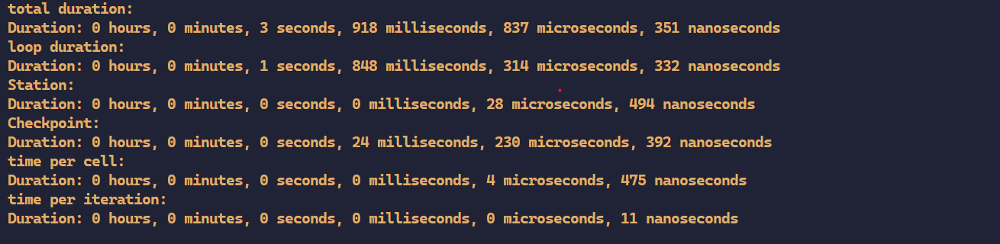
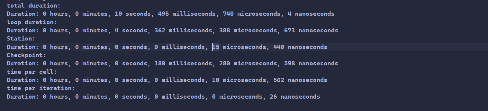
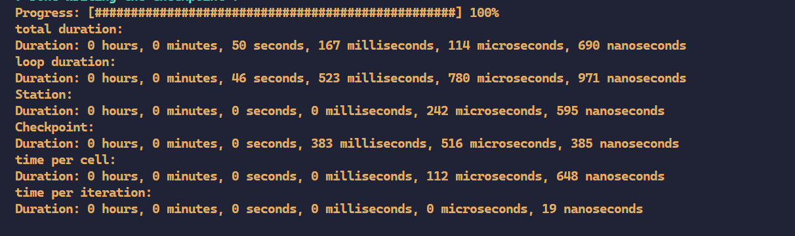
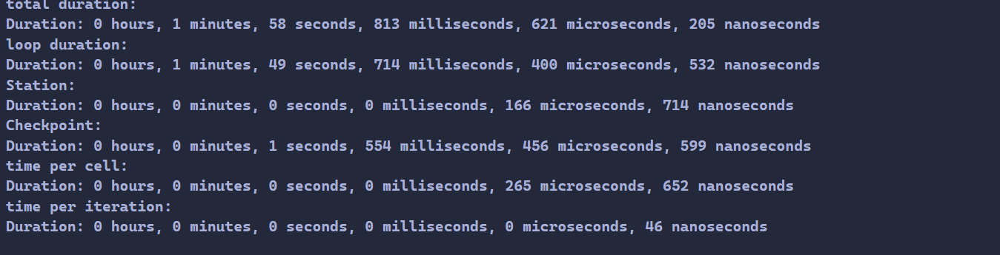

Optimization
=============

ARA
---

Upload your code and Ch. 6’s input data to the cluster. Compile your code on the cluster
........................................................................................

To deploy the project on the cluster, we cloned it from our Git repository and included all submodules.

.. code-block:: shell

   git submodule init
   git submodule update

To compile our code, we utilized an sbatch script, necessitating adjustments to the paths in our sconstruct.

.. code-block:: shell

   #!/bin/bash
   #SBATCH --job-name=tsunami
   #SBATCH --output=tsunami_output.txt
   #SBATCH --error=tsunami_error.txt
   #SBATCH --partition=s_hadoop
   #SBATCH --nodes=1
   #SBATCH --ntasks=1
   #SBATCH --time=10:00
   #SBATCH --cpus-per-task=72

   # Set the email address where notifications should be sent.
   #SBATCH --mail-user=minawe.mohamad.khaled@uni-jena.de

   # Specify the types of email notifications you want to receive.
   #SBATCH --mail-type=BEGIN,END,FAIL

   # Load modules 
   module load tools/python/3.8
   module load compiler/gcc/11.2.0
   module load compiler/intel/2020-Update2
   module load libs/hdf5/1.10.8-gcc-10.2.0
   module load libs/zlib/1.2.11-intel-2018
   module load libs/netcdf/4.6.1-intel-2018
   python3.8 -m pip install --user scons

   date
   scons
   ./build/tsunami_lab

in the sconstruct we had to add pathes fo the compiler to it.

The SConstruct on our PC appears different due to issues encountered when loading the Intel compiler on the cluster.
we tried to load the intel compiler but everytime we load it we get a netcdf error 

.. code-block:: python

   ##
   # @author Alexander Breuer (alex.breuer AT uni-jena.de)
   #
   # @section DESCRIPTION
   # Entry-point for builds.
   ##
   import SCons
   import os
   import SCons.Script

   print( '####################################' )
   print( '### Tsunami Lab                  ###' )
   print( '###                              ###' )
   print( '### https://scalable.uni-jena.de ###' )
   print( '####################################' )
   print()
   print('runnning build script')

   # configuration
   vars = Variables()

   vars.AddVariables(
      EnumVariable('mode',
                  'compile modes, option \'san\' enables address and undefined behavior sanitizers',
                  'release',
                  allowed_values=('release', 'debug', 'release+san', 'debug+san')
                  ),
      BoolVariable('use_report',
                  'Enable compiler optimization report',
                  False  # Set the default value to False; adjust as needed
                  ),
      PathVariable('custom_cxx',
                  'Path to a custom C++ compiler',
                  os.environ.get('CXX', ''),
                  PathVariable.PathAccept
                  )
   )

   # exit in the case of unknown variables
   if vars.UnknownVariables():
   print( "build configuration corrupted, don't know what to do with: " + str(vars.UnknownVariables().keys()) )
   exit(1)

   # create environment
   env = Environment( variables = vars )

   if env['custom_cxx']:
      env.Replace(CXX=env['custom_cxx'])
      print("Selected Compiler: Custom Compiler")

   compiler_path = env['CXX']     
   compiler_name = os.path.basename(compiler_path)

   if env['use_report']:
   if not (compiler_name == 'icpc'):
      print("Warning: Cannot generate report because you are running the code on the GNU Compiler.")
   else:
      env.Append(CXXFLAGS=['-qopt-report=5'])
      print("the report is in the build folder")  

   # generate help message
   Help( vars.GenerateHelpText( env ) )

   # add default flags
   if (compiler_name == 'icpc'):
      env.Append( CXXFLAGS = [ '-std=c++17',
                           '-Wall',
                           '-Wextra',
                           '-Werror' ] )
   else:    
   env.Append( CXXFLAGS = [ '-std=c++17',
                           '-Wall',
                           '-Wextra',
                           '-Wpedantic',
                           '-Werror' ] )

   # set optimization mode
   if 'debug' in env['mode']:
   env.Append( CXXFLAGS = [ '-g',
                              '-O2' ] )
   else:
   env.Append( CXXFLAGS = [ '-O3' ] )

   # add sanitizers
   if 'san' in  env['mode']:
   env.Append( CXXFLAGS =  [ '-g',
                              '-fsanitize=float-divide-by-zero',
                              '-fsanitize=bounds',
                              '-fsanitize=address',
                              '-fsanitize=undefined',
                              '-fno-omit-frame-pointer' ] )
   env.Append( LINKFLAGS = [ '-g',
                              '-fsanitize=address',
                              '-fsanitize=undefined' ] )
   

   env.Append(LIBS=['netcdf'])

   env.Append(LIBS=['z'])

   env.Append(LIBS=['hdf5_serial'])

   if 'LD_LIBRARY_PATH' not in env['ENV']:
      env['ENV']['LD_LIBRARY_PATH'] = ''

   env['ENV']['LD_LIBRARY_PATH'] = '/usr/lib/x86_64-linux-gnu' + env['ENV']['LD_LIBRARY_PATH']

   # add Catch2
   env.Append(CXXFLAGS = [ '-isystem', 'submodules/Catch2/single_include'])

   # add nlohmann json 
   env.Append(CXXFLAGS = ['-isystem', 'submodules/json/single_include'])

   env.Append(LIBPATH=['/home/winter/tools/netcdf/include'])

   # get source files
   VariantDir( variant_dir = 'build/src',
               src_dir     = 'src' )

   env.sources = []
   env.tests = []

   Export('env')
   SConscript( 'build/src/SConscript' )
   Import('env')

   env.Program( target = 'build/tsunami_lab',
               source = env.sources + env.standalone )

   env.Program( target = 'build/tests',
               source = env.sources + env.tests )

We tried using ``os.environ`` to fetch the compiler paths, but it only retrieved the path of the GNU compiler on the cluster. Everything worked perfectly on our local PC.

However, we encountered two errors on the cluster while compiling the code with the Intel compiler:

We encounter this error when attempting to append the NetCDF, HDF5, and zlib to our environment using the provided code.

.. code-block:: python

   
   env.Append(LIBS=['netcdf'])

   env.Append(LIBS=['z'])

   env.Append(LIBS=['hdf5_serial'])

   if 'LD_LIBRARY_PATH' not in env['ENV']:
      env['ENV']['LD_LIBRARY_PATH'] = ''

   env['ENV']['LD_LIBRARY_PATH'] = '/usr/lib/x86_64-linux-gnu' + env['ENV']['LD_LIBRARY_PATH']

   # add Catch2
   env.Append(CXXFLAGS = [ '-isystem', 'submodules/Catch2/single_include'])

   # add nlohmann json 
   env.Append(CXXFLAGS = ['-isystem', 'submodules/json/single_include'])

   env.Append(LIBPATH=['/home/winter/tools/netcdf/include'])

.. code-block:: shell

   
   Error: A license for Comp-CL could not be obtained.  (-1,359,2).

   Is your license file in the right location and readable?
   The location of your license file should be specified via
   the $INTEL_LICENSE_FILE environment variable.

   License file(s) used were (in this order):
   **  1.  /cluster/intel/compilers_and_libraries_2020.2.254/linux/bin/intel64/../../Licenses
   **  2.  /home/ni57qip/Licenses
   **  3.  /home/ni57qip/intel/licenses
   **  4.  /opt/intel/licenses
   **  5.  /Users/Shared/Library/Application Support/Intel/Licenses
   **  6.  /cluster/intel/compilers_and_libraries_2020.2.254/linux/bin/intel64/*.lic

   Please refer http://software.intel.com/sites/support/ for more information..

   icpc: error #10052: could not checkout FLEXlm license
   scons: *** [build/src/io/Csv/Csv.o] Error 1
   vtune: Error: Cannot find application file "/home/ni57qip/tsunami_lab/build/tsunami_lab".

We encounter this error when attempting to append the NetCDF, HDF5, and zlib to our environment using the provided code.

.. code-block:: python

   conf = Configure(env)
   if not conf.CheckLibWithHeader('netcdf','netcdf.h','c++'):
   print('Did not find netcdf.h, exiting!')
   exit(1)

.. code-block:: shell 

   runnning build script
   Selected Compiler: Custom Compiler
   the report is in the build folder
   Checking for C++ library netcdf... no
   Did not find netcdf.h, exiting!

to build the project with a custom compiler :

 

.. code-block:: shell
   
   scons custom_cxx=/opt/intel/oneapi/compiler/2023.2.2/linux/bin/intel64/icpc use_report=True

The ``custom_cxx`` option is used to specify the compiler by providing its path. Meanwhile, ``use_report ``
is utilized to determine whether to generate a report, which is only available when utilizing the Intel compiler.

   
Run different scenarios using interactive and batch jobs
.........................................................

We executed two scenarios, one for Tohoku and another for Chile, using the following configuration file:

**chile**:

.. code-block:: cpp

   {
      "solver" : "fwave",
      "dimension_x" : 3500000,
      "dimension_y" : 2950000,
      "setup" :  "tsunamievent2d",
      "nx" : 700,
      "ny" : 590,
      "k"  : 3,
      "hu" : 0,
      "location" : 0,
      "hv":0.0,
      "hr": 55,
      "hl": 25,
      "domain_start_x" : -3000000,
      "domain_start_y" : -1450000,
      "wavepropagation" : "2d",
      "endtime" : 36000,
      "writer" : "netcdf",
      "bathfile" : "data/output/chile_gebco20_usgs_250m_bath_fixed.nc",
      "disfile" : "data/output/chile_gebco20_usgs_250m_displ_fixed.nc",
      "outputfilename": "simulation.nc",
      "usecheckpoint" : false
   }

**tohoku**:

.. code-block:: cpp 

   {
      "solver" : "fwave",
      "dimension_x" : 2700000,
      "dimension_y" : 1500000,
      "setup" :  "tsunamievent2d",
      "nx" : 700,
      "ny" : 590,
      "k"  : 3,
      "hu" : 0,
      "location" : 0,
      "hv":0.0,
      "hr": 55,
      "hl": 25,
      "domain_start_x" : -200000,
      "domain_start_y" : -750000,
      "wavepropagation" : "2d",
      "endtime" : 36000,
      "writer" : "netcdf",
      "bathfile" : "data/output/tohoku_gebco20_ucsb3_250m_bath.nc",
      "disfile" : "data/output/tohoku_gebco20_ucsb3_250m_displ.nc",
      "outputfilename": "simulation.nc",
      "usecheckpoint" : false
   }

Add a timer to your solver which allows you to measure the duration of the time stepping loop. 
................................................................................................

lets add a timer in our main.cpp file and lets not forgett to exlude the io overhead nad the setup time from the measurements

.. code-block:: cpp

   int main() {

      auto l_startTimer = std::chrono::high_resolution_clock::now(); 

      tsunami_lab::t_idx l_nx = 0;
      tsunami_lab::t_idx l_ny = 1;
      tsunami_lab::t_real l_dxy = 25;

      ........

      std::chrono::nanoseconds l_durationWriting = std::chrono::nanoseconds::zero();
      std::chrono::nanoseconds l_durationWritingStation = std::chrono::nanoseconds::zero();
      std::chrono::nanoseconds l_durationWritingCheckpoint = std::chrono::nanoseconds::zero();
      std::chrono::nanoseconds l_durationWritingConstat = std::chrono::nanoseconds::zero();

      .......

      auto l_loopTimer = std::chrono::high_resolution_clock::now();
  
      if(l_temp_writer == "netcdf"){
         l_netCdf = new tsunami_lab::io::NetCdf(l_nx,l_ny,l_k,l_outputFile);
         auto l_startWritingCostant = std::chrono::high_resolution_clock::now();
         l_netCdf->fillConstants(l_nx,
                                 l_ny,
                                 l_k,
                                 l_waveProp->getStride(),
                                 l_dxy,
                                 l_domain_start_x,
                                 l_domain_start_y,
                                 l_waveProp->getBathymetry(),
                                 l_outputFile);
         auto l_endWritingCostant = std::chrono::high_resolution_clock::now();
         l_durationWritingConstat =  l_endWritingCostant  - l_startWritingCostant ;            
      }

      while( l_simTime < l_temp_endtime ){
         l_waveProp->setGhostOutflow(false);
         if( l_timeStep % 25 == 0 ) {

            auto l_startWriting = std::chrono::high_resolution_clock::now();

            if(l_temp_writer == "csv"){
            std::string l_path = "outputs/solution_" + std::to_string(l_time_step_index) + ".csv";
            std::ofstream l_file;
            l_file.open( l_path );
            tsunami_lab::io::Csv::write(l_dxy,
                                          l_nx,
                                          l_ny,
                                          l_waveProp->getStride(),
                                          l_domain_start_x,
                                          l_domain_start_y,
                                          l_temp_waveprop,
                                          l_waveProp->getHeight(),
                                          l_waveProp->getMomentumX(),
                                          l_waveProp->getMomentumY(),
                                          l_waveProp->getBathymetry(),
                                          l_file);
            auto l_endWriting = std::chrono::high_resolution_clock::now();
            l_durationWriting += l_endWriting - l_startWriting;

            l_file.close();
            }else{
            
            l_netCdf->updateFile( l_nx,
                                    l_ny,
                                    l_waveProp->getStride(),
                                    l_time_step_index,
                                    l_k,
                                    l_simTime,
                                    l_waveProp->getHeight(),
                                    l_waveProp->getMomentumX(),
                                    l_waveProp->getMomentumY(),
                                    l_outputFile);
            auto l_endWriting = std::chrono::high_resolution_clock::now();
            //duration of the writing method
            l_durationWriting += l_endWriting - l_startWriting ;

                                    
            }
            l_time_step_index++;
            
         if(l_temp_waveprop == "2d"){  
            if(l_time_step_index%7 == 0 ){
               auto l_startWritingCheckpoint = std::chrono::high_resolution_clock::now();
            std::cout << "\n\033[1;34m" << "Started writing a new Checkpoint ."<< "\033[0m" << std::endl;
            l_netCdf->createCheckPoint(l_temp_solver,
                                          l_domain_start_x,
                                          l_domain_start_y,
                                          l_temp_dimension_x,
                                          l_temp_dimension_y,
                                          l_temp_endtime,
                                          l_simTime,
                                          l_frequency,
                                          l_dt,
                                          l_last_simTime_time,
                                          l_waveProp->getBathymetry(),
                                          l_waveProp->getHeight(),
                                          l_waveProp->getMomentumX(),
                                          l_waveProp->getMomentumY(),
                                          l_time_step_index,
                                          l_waveProp->getStride(),
                                          l_nx,
                                          l_ny,
                                          l_k,
                                          l_temp_setup,
                                          tsunami_lab::io::Station::Stringify(),
                                          l_checkPointName,
                                          l_temp_disFile,
                                          l_temp_bathFile);

               auto l_endWritingCheckpoint = std::chrono::high_resolution_clock::now();
               l_durationWritingCheckpoint += l_endWritingCheckpoint - l_startWritingCheckpoint ;

            std::cout << "\033[1;32m\u2713 " << "Done writing the Checkpoint ."<< "\033[0m"<< std::endl;
            }
            }
         }
         
         //STATIONS_---------------------------------------------START 
         if(l_current_frequency_time <= l_simTime){
            auto l_startWritingStation = std::chrono::high_resolution_clock::now();
            for (const auto& station : l_stations) {
            std::string l_foldername = "stations/"+station.i_name;
            if (!std::filesystem::exists(l_foldername)){
               std::filesystem::create_directory(l_foldername);
            }
            //compute cell ID
            tsunami_lab::t_idx l_ix = ((station.i_x - l_domain_start_x ) / l_dxy )+ l_waveProp->getGhostcellX();
            tsunami_lab::t_idx l_iy = ((station.i_y - l_domain_start_y ) / l_dxy )+ l_waveProp->getGhostcellY();
            if(l_temp_waveprop == "1d"){
               l_iy = 0; 
            }
            tsunami_lab::t_idx l_id = l_iy * l_waveProp->getStride() + l_ix;
            const tsunami_lab::t_real* l_water_height =  l_waveProp->getHeight();
            const tsunami_lab::t_real* l_water_hu =  l_waveProp->getMomentumX();
            const tsunami_lab::t_real* l_water_hv =  l_waveProp->getMomentumY();
            std::string l_station_path = l_foldername +"/"+ station.i_name+".csv";
            if(l_temp_waveprop == "2d"){
            tsunami_lab::io::Station::write(l_ix,
                                             l_iy,
                                             l_simTime,
                                             l_water_height[l_id],
                                             l_water_hu[l_id],
                                             l_water_hv[l_id],
                                             l_station_path,
                                             l_temp_waveprop);
            }else{
               tsunami_lab::io::Station::write(l_ix,
                                             l_iy,
                                             l_simTime,
                                             l_water_height[l_id],
                                             l_water_hu[l_id],
                                             -1,
                                             l_station_path,
                                             l_temp_waveprop);
            }
            }
            l_last_simTime_time = l_simTime;
            l_current_frequency_time = l_current_frequency_time + l_frequency;
            auto l_endWritingStation = std::chrono::high_resolution_clock::now();
            l_durationWritingStation += l_endWritingStation - l_startWritingStation ;

         }
         //STATIONS----------------------------------------------END

         l_waveProp->timeStep( l_scaling);
         l_timeStep++;
         l_simTime += l_dt;
         updateProgressBar(l_simTime, l_temp_endtime,50);

      }

Now let's calculate the time per cell and iteration.

.. code-block:: cpp 

   auto l_endTimer = std::chrono::high_resolution_clock::now();
   auto l_duration = l_endTimer - l_startTimer;
   auto l_durationLoop = l_endTimer - l_loopTimer;

  std::cout << std::endl;
  std::cout << "total duration: " << std::endl;
  printDuration(l_duration);
  std::cout << "loop duration: " << std::endl;
  printDuration(l_durationLoop - l_durationWritingStation - l_durationWritingCheckpoint - l_durationWriting- l_durationWritingConstat);
  std::cout << "Station: " << std::endl;
  printDuration(l_durationWritingStation);
  std::cout << "Checkpoint: " << std::endl;
  printDuration(l_durationWritingCheckpoint);
  std::cout << "time per cell: " << std::endl;
  printDuration((l_durationLoop - l_durationWritingStation - l_durationWritingCheckpoint - l_durationWriting- l_durationWritingConstat)/(l_nx * l_ny));
  std::cout << "time per iteration: " << std::endl;
  printDuration((l_durationLoop - l_durationWritingStation - l_durationWritingCheckpoint - l_durationWriting- l_durationWritingConstat)/(l_timeStep * l_nx * l_ny));

he ``printDuration`` is a method that we implemented to display the time in hours, minutes, seconds, and nanoseconds.

.. code-block:: cpp 

   void printDuration(std::chrono::nanoseconds duration) {
   auto hours = std::chrono::duration_cast<std::chrono::hours>(duration);
      duration -= hours;

      auto minutes = std::chrono::duration_cast<std::chrono::minutes>(duration);
      duration -= minutes;

      auto seconds = std::chrono::duration_cast<std::chrono::seconds>(duration);
      duration -= seconds;

      auto milliseconds = std::chrono::duration_cast<std::chrono::milliseconds>(duration);
      duration -= milliseconds;

      auto microseconds = std::chrono::duration_cast<std::chrono::microseconds>(duration);
      duration -= microseconds;

      auto nanoseconds = duration;

      std::cout << "Duration: " << hours.count() << " hours, "
               << minutes.count() << " minutes, "
               << seconds.count() << " seconds, "
               << milliseconds.count() << " milliseconds, "
               << microseconds.count() << " microseconds, "
               << nanoseconds.count() << " nanoseconds" << std::endl;
   }

Is the cluster faster than your own computer
............................................

We compiled both events on Mohamad Khaled Minawe's PC and the cluster, then compared the results.
the results for both can be seen in the following pictures:

For Chile:

Mohamad Khaled Minawe's PC:

cluster:

For Tohoku:

Mohamad Khaled Minawe's PC:

cluster:

The pictures indicate that Mohamad Khaled's PC is significantly faster than the cluster.

Compilers
---------

Recompile your code using recent versions of the GNU and Intel compilers
.........................................................................

We encountered an issue that prevented us from compiling our code on the cluster. However, we were able to successfully compile it on our home machine.
Initially, let's obtain the APT Package Manager from the Intel website by executing the following commands:

 `site`_:

.. _site: https://www.intel.com/content/www/us/en/developer/tools/oneapi/base-toolkit-download.html?operatingsystem=linux&distributions=aptpackagemanager

.. code-block:: shell

   sudo apt install intel-basekit

   wget -O- https://apt.repos.intel.com/intel-gpg-keys/GPG-PUB-KEY-INTEL-SW-PRODUCTS.PUB \ | gpg --dearmor | sudo tee /usr/share/keyrings/oneapi-archive-keyring.gpg > /dev/null

   echo "deb [signed-by=/usr/share/keyrings/oneapi-archive-keyring.gpg] https://apt.repos.intel.com/oneapi all main" | sudo tee /etc/apt/sources.list.d/oneAPI.list

   sudo apt update

Now, install the compiler by executing the following command: 

.. code-block:: shell 

   sudo apt install intel-oneapi-compiler-dpcpp-cpp-and-cpp-classic-2023.2.2

The SConstruct file we utilized on our machine can be located above.

Now, let's compare the compilers used in both scenarios :

chile:

   intel:

      .. image:: _static/intelCompiler.png
         :width: 700px
         :height: 500px
         :scale: 100 %
         :alt: alternate text
         :align: right

   GNU:

       .. image:: _static/GNU.png
         :width: 700px
         :height: 500px
         :scale: 100 %
         :alt: alternate text
         :align: right

Tohoku:

   intel:

      .. image:: _static/intelCompiler1.png
         :width: 700px
         :height: 500px
         :scale: 100 %
         :alt: alternate text
         :align: right

   GNU:

       .. image:: _static/GNU1.png
         :width: 700px
         :height: 500px
         :scale: 100 %
         :alt: alternate text
         :align: right

Compile your code using both compilers and try different optimization switches
...............................................................................

When utilizing the -O0 optimization flag with the Intel compiler, an error arises. It appears that the Intel Compiler encounters issues with directory iterators in this scenario.

.. code-block:: 

   main.cpp:(.text._ZNSt10filesystem7__cxx1118directory_iteratorD1Ev[_ZNSt10filesystem7__cxx1118directory_iteratorD1Ev]+0x14):
   undefined reference to `std::__shared_ptr<std::filesystem::__cxx11::_Dir, (__gnu_cxx::_Lock_policy)2>::~__shared_ptr()'
   scons: *** [build/tsunami_lab] Error 1
   scons: building terminated because of errors.    

Let's now examine the distinctions between the GNU Compiler Collection (GCC) and the Intel C++ Compiler (ICPC) for the tohoku scenario.

our Local machine has a cpu : Intel Core i7 13700KF 3.49-5.40GHz

.. list-table:: Title
   :widths: 25 25 50
   :header-rows: 2

   * - Flags
     - GNU Compiler
     - Intel Compiler
   * - -O0
     - 3min,51sec,832millisecond,558microseconds,804nanoseconds
     - error
   * - -O1
     - 0min,59sec,307millisecond,936microseconds,430nanoseconds
     - 2min,53sec,193millisecond,220microseconds,610nanoseconds
   * - -O2
     - 0min,47sec,892millisecond,959microseconds,954nanoseconds
     - 0min,42sec,789millisecond,730microseconds,514nanoseconds  
   * - -O3
     - 0min,46sec,549millisecond,543microseconds,532nanoseconds
     - 0min,42seconds,277milliseconds,904microseconds,396 nanoseconds
   * - -Ofast
     - 0min,44sec,182millisecond,275microseconds,818nanoseconds
     - 40seconds,746 milliseconds,525microseconds,167nanoseconds

In this table, we conducted a comparison of loop execution times, excluding IO header and setup time. 
It is evident that the Intel compiler outperforms the GNU compiler when utilizing specific flags. Unfortunately, a direct
comparison without optimization flags was not possible due to encountered errors. The Intel Compiler (icc)
stands out as the preferred choice for performance-critical computations, especially on clusters with Intel CPUs.
Using the ``-O1`` optimization flags, it may be observed that the GNU compiler tends to outperform the Intel compiler.

not lets compare the time per cell and time per iteration

time per iteration:

.. list-table:: Title
   :widths: 25 25 50
   :header-rows: 1

   * - Flags
     - GNU Compiler
     - Intel Compiler
     - Time per iteration
   * - -O0
     - 98 nanoseconds
     - error
   * - -O1
     - 25 nanoseconds
     - 73 nanoseconds
   * - -O2
     - 20 nanoseconds
     - 18 nanoseconds  
   * - -O3
     - 19 nanoseconds
     - 18 nanoseconds
   * - -Ofast
     - 18 nanoseconds
     - 17 nanoseconds

time per cell:

.. list-table:: Title
   :widths: 25 25 50
   :header-rows: 2

   * - Flags
     - GNU Compiler
     - Intel Compiler
   * - -O0
     - 561 microseconds,337 nanoseconds
     - error
   * - -O1
     - 143 microseconds,602 nanoseconds
     - 419 microseconds, 354 nanoseconds
   * - -O2
     - 115 microseconds,963 nanoseconds
     - 103 microseconds,607 nanoseconds  
   * - -O3
     - 112 microseconds,710 nanoseconds
     - 106 microseconds,554 nanoseconds
   * - -Ofast
     - 106 microseconds,978 nanoseconds
     - 103 microseconds,512 nanoseconds

As previously mentioned, the Intel compiler outperforms the GNU compiler. However, when employing the -O1 flag, it becomes evident that the GNU compiler surpasses the Intel compiler. In the time per iteration table,
we observe that with the -O2 and -O3 flags, the GNU compiler is approaching the performance level of the Intel Compiler.

Historically, the Intel Compiler has been known for producing highly optimized code for Intel architectures. It can take advantage of specific
features of Intel processors, such as vectorization and other optimizations. This can lead to better performance on Intel CPUs compared to GCC in some cases.

GCC, on the other hand, is a widely used open-source compiler that supports multiple architectures, not just Intel. It is known for its portability and the
ability to generate code for various platforms. GCC is the default compiler on many Unix-like systems, and it is commonly used in open-source projects.

Research potential implications of the optimization flags on the numerical accuracy
...................................................................................

Optimization flags, are settings that developers can use to instruct the compiler on how to
optimize the generated machine code for a program. These flags can significantly impact the performance of the compiled code, but they can also have implications
for numerical accuracy. Here are some potential implications to consider:

**Precision and Accuracy:**

Floating-point precision: Some optimization flags may alter the default floating-point precision.
For example, flags like -ffast-math may sacrifice precision for speed by allowing the compiler to use less accurate, but faster, floating-point operations.

**Vectorization:**

Vectorization: Flags that enable vectorization can improve performance by allowing the compiler to use SIMD
(Single Instruction, Multiple Data) instructions. However, this may introduce subtle differences in numerical results due to the use of vectorized operations.

**Math Library Replacement:**

Libm replacement: Some compilers allow replacing the standard math library functions
with potentially faster, but less accurate, implementations. This can impact the accuracy of mathematical computations.

Here are a few optimization flags that may impact numerical accuracy:

-ffast-math:  flag enables additional optimizations that may violate strict mathematical rules. It can result in faster code but may sacrifice numerical accuracy.

Intel compilers option
.......................

To produce an optimization report, execute the following command:

.. code-block:: shell 

   scons custom_cxx=/opt/intel/oneapi/compiler/2023.2.2/linux/bin/intel64/icpc use_report=True

Prior to executing the command, we will generate an optimization report using the -O3 flag and then proceed to run our solver for the Tohoku scenario.
And don't forget to include the ``-qopt-report`` flag in the SCons construct.

.. code-block:: python

      vars.AddVariables(
         EnumVariable('mode',
                     'compile modes, option \'san\' enables address and undefined behavior sanitizers',
                     'release',
                     allowed_values=('release', 'debug', 'release+san', 'debug+san')
                     ),
         BoolVariable('use_report',
                     'Enable compiler optimization report',
                     False  # Set the default value to False; adjust as needed
                     ),
         PathVariable('custom_cxx',
                     'Path to a custom C++ compiler',
                     os.environ.get('CXX', ''),
                     PathVariable.PathAccept
                     )
      )

      # exit in the case of unknown variables
      if vars.UnknownVariables():
      print( "build configuration corrupted, don't know what to do with: " + str(vars.UnknownVariables().keys()) )
      exit(1)

      # create environment
      env = Environment( variables = vars )

      if env['custom_cxx']:
         env.Replace(CXX=env['custom_cxx'])
         print("Selected Compiler: Custom Compiler")

      compiler_path = env['CXX']     
      compiler_name = os.path.basename(compiler_path)

      if env['use_report']:
      if not (compiler_name == 'icpc'):
         print("Warning: Cannot generate report because you are running the code on the GNU Compiler.")
      else:
         env.Append(CXXFLAGS=['-qopt-report=5'])
         print("the report is in the build folder")  

Now, after executing our solver, navigate to the build folder. Inside, you will find optimization reports for each file.
lets Analyze the time-consuming parts of the code. 
lets start from our fwave solver : 

.. code-block:: cpp 

      Begin optimization report for: tsunami_lab::solvers::fwave::netUpdates(tsunami_lab::t_real, tsunami_lab::t_real, tsunami_lab::t_real, tsunami_lab::t_real, tsunami_lab::t_real, tsunami_lab::t_real, tsunami_lab::t_real *, tsunami_lab::t_real *)

      Report from: Interprocedural optimizations [ipo]

   INLINE REPORT: (tsunami_lab::solvers::fwave::netUpdates(tsunami_lab::t_real, tsunami_lab::t_real, tsunami_lab::t_real, tsunami_lab::t_real, tsunami_lab::t_real, tsunami_lab::t_real, tsunami_lab::t_real *, tsunami_lab::t_real *)) [6/8=75.0%] build/src/solvers/fwave.cpp(121,74)
   -> INLINE: (163,5) tsunami_lab::solvers::fwave::eigenvalues(tsunami_lab::t_real, tsunami_lab::t_real, tsunami_lab::t_real, tsunami_lab::t_real, tsunami_lab::t_real &, tsunami_lab::t_real &) (isz = 22) (sz = 37)
      -> INLINE (MANUAL): (13,21) std::sqrt(float) (isz = 0) (sz = 7)
      -> INLINE (MANUAL): (14,21) std::sqrt(float) (isz = 0) (sz = 7)
      -> INLINE (MANUAL): (24,34) std::sqrt(float) (isz = 0) (sz = 7)
   -> INLINE: (167,5) tsunami_lab::solvers::fwave::inverseMatrix(tsunami_lab::t_real, tsunami_lab::t_real, tsunami_lab::t_real *) (isz = 14) (sz = 23)
   -> INLINE: (170,5) tsunami_lab::solvers::fwave::flux(tsunami_lab::t_real, tsunami_lab::t_real, tsunami_lab::t_real, tsunami_lab::t_real, tsunami_lab::t_real *) (isz = 59) (sz = 72)
      -> EXTERN: (40,21) pow(double, double) noexcept(true)
      -> EXTERN: (41,27) pow(double, double) noexcept(true)
      -> EXTERN: (46,21) pow(double, double) noexcept(true)
      -> EXTERN: (47,27) pow(double, double) noexcept(true)
   -> INLINE: (175,5) tsunami_lab::solvers::fwave::eigencoefficientAlpha(tsunami_lab::t_real *, tsunami_lab::t_real *, tsunami_lab::t_real, tsunami_lab::t_real *) (isz = 25) (sz = 36)
   -> INLINE: (179,5) tsunami_lab::solvers::fwave::decompose(tsunami_lab::t_real *, tsunami_lab::t_real *, tsunami_lab::t_real *, tsunami_lab::t_real *) (isz = 64) (sz = 75)

In your report, the functions pow(double, double) are marked as EXTERN. This suggests that the implementation of the pow function
is not available in the current translation unit, and the compiler has generated external calls to this function. However, all other functions within the **NetUpdate** function are completely inlined. Let's examine and evaluate the
**wavepropagation2::timestep**, which consumes the most time along with the **NetUpdate** function.

.. code-block:: cpp 

   begin optimization report for: tsunami_lab::patches::WavePropagation2d::timeStep(tsunami_lab::patches::WavePropagation2d *, tsunami_lab::t_real)

      Report from: Interprocedural optimizations [ipo]

      INLINE REPORT: (tsunami_lab::patches::WavePropagation2d::timeStep(tsunami_lab::patches::WavePropagation2d *, tsunami_lab::t_real)) [11/24=45.8%] build/src/patches/wavepropagation2d/WavePropagation2d.cpp(48,75)
      -> INDIRECT- (VIRTUAL): (66,19)  tsunami_lab::patches::WavePropagation2d::setGhostOutflow(tsunami_lab::patches::WavePropagation2d *, bool)  (isz = 906) (sz = 913)
         [[ Unable to inline indirect callsite  <1>]]
      -> INLINE (MANUAL): (71,21) tsunami_lab::patches::WavePropagation2d::getIndex(tsunami_lab::patches::WavePropagation2d *, tsunami_lab::t_idx, tsunami_lab::t_idx) (isz = 1) (sz = 11)
      -> INLINE (MANUAL): (72,21) tsunami_lab::patches::WavePropagation2d::getIndex(tsunami_lab::patches::WavePropagation2d *, tsunami_lab::t_idx, tsunami_lab::t_idx) (isz = 1) (sz = 11)
      -> EXTERN: (75,9) tsunami_lab::solvers::Roe::netUpdates(tsunami_lab::t_real, tsunami_lab::t_real, tsunami_lab::t_real, tsunami_lab::t_real, tsunami_lab::t_real *, tsunami_lab::t_real *)
      -> EXTERN: (82,9) tsunami_lab::solvers::fwave::netUpdates(tsunami_lab::t_real, tsunami_lab::t_real, tsunami_lab::t_real, tsunami_lab::t_real, tsunami_lab::t_real, tsunami_lab::t_real, tsunami_lab::t_real *, tsunami_lab::t_real *)
      -> INDIRECT- (VIRTUAL): (112,19)  tsunami_lab::patches::WavePropagation2d::setGhostOutflow(tsunami_lab::patches::WavePropagation2d *, bool)  (isz = 906) (sz = 913)
         [[ Unable to inline indirect callsite  <1>]]
      -> INLINE (MANUAL): (118,21) tsunami_lab::patches::WavePropagation2d::getIndex(tsunami_lab::patches::WavePropagation2d *, tsunami_lab::t_idx, tsunami_lab::t_idx) (isz = 1) (sz = 11)
      -> INLINE (MANUAL): (119,21) tsunami_lab::patches::WavePropagation2d::getIndex(tsunami_lab::patches::WavePropagation2d *, tsunami_lab::t_idx, tsunami_lab::t_idx) (isz = 1) (sz = 11)
      -> EXTERN: (122,9) tsunami_lab::solvers::Roe::netUpdates(tsunami_lab::t_real, tsunami_lab::t_real, tsunami_lab::t_real, tsunami_lab::t_real, tsunami_lab::t_real *, tsunami_lab::t_real *)
      -> EXTERN: (129,9) tsunami_lab::solvers::fwave::netUpdates(tsunami_lab::t_real, tsunami_lab::t_real, tsunami_lab::t_real, tsunami_lab::t_real, tsunami_lab::t_real, tsunami_lab::t_real, tsunami_lab::t_real *, tsunami_lab::t_real *)

The Netupdate function is considered an external function, signifying that it is defined in other translation units (source files) and is not inlined at the call site. Instead, the compiler generates a call to the
external function, and the implementation of the function is anticipated to be located elsewhere in the program.

now lets see the vectorization:

In the context of WavePropagation2D, it becomes apparent that the loop was not successfully vectorized by our compiler.

.. code-block:: cpp

   LOOP BEGIN at build/src/patches/wavepropagation2d/WavePropagation2d.cpp(19,3)
      remark #15382: vectorization support: call to function __cxa_throw_bad_array_new_length() cannot be vectorized   [ build/src/patches/wavepropagation2d/WavePropagation2d.cpp(20,55) ]
      remark #15382: vectorization support: call to function operator new cannot be vectorized   [ build/src/patches/wavepropagation2d/WavePropagation2d.cpp(20,55) ]
      remark #15382: vectorization support: call to function memset(void *, int, unsigned long) cannot be vectorized   [ build/src/patches/wavepropagation2d/WavePropagation2d.cpp(20,55) ]
      remark #15382: vectorization support: call to function __cxa_throw_bad_array_new_length() cannot be vectorized   [ build/src/patches/wavepropagation2d/WavePropagation2d.cpp(21,55) ]
      remark #15382: vectorization support: call to function operator new cannot be vectorized   [ build/src/patches/wavepropagation2d/WavePropagation2d.cpp(21,55) ]
      remark #15382: vectorization support: call to function memset(void *, int, unsigned long) cannot be vectorized   [ build/src/patches/wavepropagation2d/WavePropagation2d.cpp(21,55) ]
      remark #15382: vectorization support: call to function __cxa_throw_bad_array_new_length() cannot be vectorized   [ build/src/patches/wavepropagation2d/WavePropagation2d.cpp(22,55) ]
      remark #15382: vectorization support: call to function operator new cannot be vectorized   [ build/src/patches/wavepropagation2d/WavePropagation2d.cpp(22,55) ]
      remark #15382: vectorization support: call to function memset(void *, int, unsigned long) cannot be vectorized   [ build/src/patches/wavepropagation2d/WavePropagation2d.cpp(22,55) ]
      remark #15344: loop was not vectorized: vector dependence prevents vectorization
   LOOP END

   LOOP BEGIN at build/src/patches/wavepropagation2d/WavePropagation2d.cpp(27,3)
      remark #15344: loop was not vectorized: vector dependence prevents vectorization
      remark #15346: vector dependence: assumed OUTPUT dependence between this->m_h[l_st][l_ce] (29:7) and this->m_hv[l_st][l_ce] (31:7)
      remark #15346: vector dependence: assumed OUTPUT dependence between this->m_hv[l_st][l_ce] (31:7) and this->m_h[l_st][l_ce] (29:7)
      remark #25015: Estimate of max trip count of loop=2

      LOOP BEGIN at build/src/patches/wavepropagation2d/WavePropagation2d.cpp(28,5)
      <Predicate Optimized v1>
         remark #25422: Invariant Condition at line 32 hoisted out of this loop
         remark #15344: loop was not vectorized: vector dependence prevents vectorization
         remark #15346: vector dependence: assumed OUTPUT dependence between this->m_h[l_st][l_ce] (29:7) and U9_V[l_ce] (33:9)
         remark #15346: vector dependence: assumed OUTPUT dependence between U9_V[l_ce] (33:9) and this->m_h[l_st][l_ce] (29:7)
         remark #25439: unrolled with remainder by 2  
      LOOP END

Now, let's examine whether the compiler successfully vectorized the extensive loops in the NetCDF code.

.. code-block:: cpp 

   LOOP BEGIN at build/src/patches/wavepropagation2d/WavePropagation2d.cpp(68,2)
   remark #15523: loop was not vectorized: loop control variable l_ey was found, but loop iteration count cannot be computed before executing the loop

   LOOP BEGIN at build/src/patches/wavepropagation2d/WavePropagation2d.cpp(69,5)
      remark #15523: loop was not vectorized: loop control variable l_ex was found, but loop iteration count cannot be computed before executing the loop
      remark #25456: Number of Array Refs Scalar Replaced In Loop: 1
   LOOP END
LOOP END

Indeed, it is evident that the compiler was unable to vectorize the large loop.

Vtune
......

Personal Contribution
---------------------

- Ward Tammaa, Daniel Schicker Doxygen Documentation
- Mohamad Khaled Minawe, Ward Tammaa, Daniel Schicker Sphnix Documentation
- Daniel Schicker, Mohamad Khaled Minawe , Ward Tammaa functions implementation
- Mohamad Khaled Minawe, Daniel Schicker, Ward Tammaa Unit Testing
- Mohamad Khaled Minawe, Daniel Schicker Geogebra Datei(Calculations for the Unit Tests)
- Ward Tammaa Hosting the code , Action runner

    