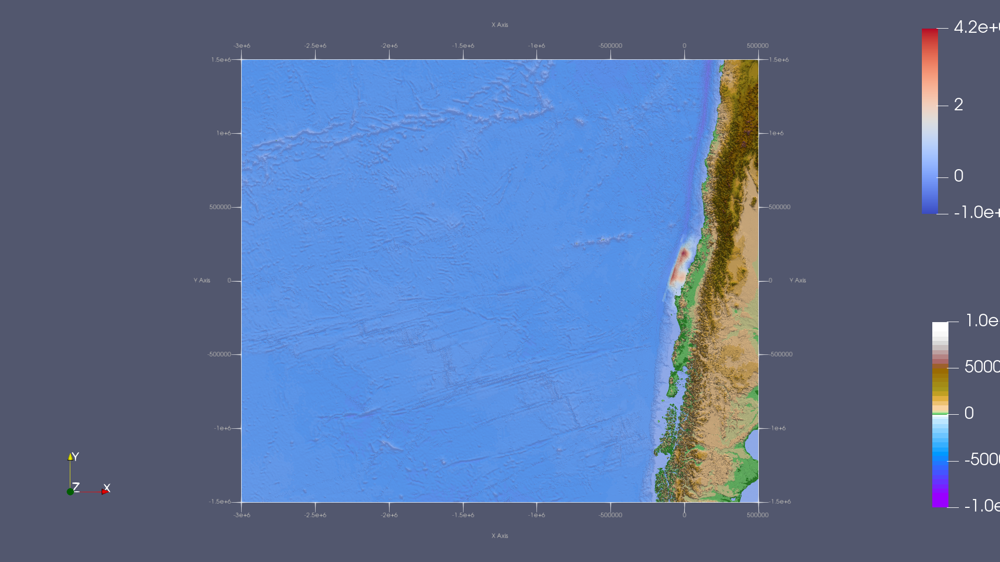
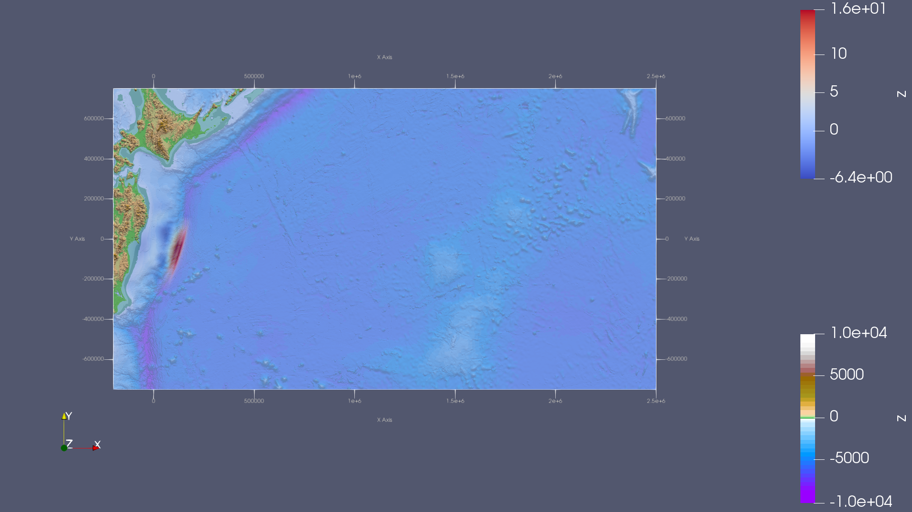

Tsunami Simulations
===========================

2010 M 8.8 Chile Event
-----------------------

Make yourself familiar with the input data
...........................................

As input data, we obtained bathymetry and displacements for the events
in Chile and Tohoku. The data we obtained can be visualized using ParaView.
While visualizing the data, we will apply a scalar warp to the bathymetry, setting the scaler value to 10.
Additionally, we will adjust the opacity of the bathymetry to 0.6 to enhance the visibility of displacement

In ParaView, we will use the following color maps `here`_:

.. _here:: https://www.earthmodels.org/date-and-tools/color-tables/gmt_colortables_for_paraview.zip

Don't forget to import the color maps in ParaView.

For Chile events, we got the following visualization:

For Tohoku events, we got the following visualization:

Simulate the tsunami event and visualize the output
....................................................

.. important:: 

   Considering both performance issues and time constraints, we will limit the simulation to 8 hours.
   for both event  

or the Chilean events, we will use different grid resolutions. However, before doing that, we need to adjust the number of timesteps we go through in main ``main.cpp``

.. code-block:: cpp 

    if( l_timeStep % 1250 == 0 )

and will add a progressbar to kn

lets now simulate the tsunami for the following resolutions:

1. 250m:

For this resolution, we will use the following config file with a specified cell width and we willvisualize it for 8 hours.

.. code-block:: cpp 

   {
   "solver" : "fwave",
   "dimension_x" : 3500000,
   "dimension_y" : 2950000,
   "setup" :  "tsunamievent2d",
   "nx" : 14000,
   "ny" : 11800,
   "hu" : 0,
   "location" : 0,
   "hv":0.0,
   "hr": 55,
   "hl": 25,
   "domain_start_x" : -3000000,
   "domain_start_y" : -1450000,
   "wavepropagation" : "2d",
   "endtime" : 28800,
   "writer" : "netcdf",
   "bathfile" : "data/output/chile_gebco20_usgs_250m_bath_fixed.nc",
   "disfile" : "data/output/chile_gebco20_usgs_250m_displ_fixed.nc"

   }

.. video:: _static/Dambreak2d.mp4
   :width: 700
   :height: 500
   :autoplay:

2. 500m:

For the 500m option, we will use the following config file, and we will visualize it for 4 hours:

.. code-block:: cpp 

   {
    "solver" : "fwave",
    "dimension_x" : 3500000,
    "dimension_y" : 2950000,
    "setup" :  "tsunamievent2d",
    "nx" : 7000,
    "ny" : 5900,
    "hu" : 0,
    "location" : 0,
    "hv":0.0,
    "hr": 55,
    "hl": 25,
    "domain_start_x" : -3000000,
    "domain_start_y" : -1450000,
    "wavepropagation" : "2d",
    "endtime" : 14400,
    "writer" : "netcdf",
    "bathfile" : "data/output/chile_gebco20_usgs_250m_bath_fixed.nc",
    "disfile" : "data/output/chile_gebco20_usgs_250m_displ_fixed.nc"

   }

.. video:: _static/Dambreak2d.mp4
   :width: 700
   :height: 500
   :autoplay:

3. 1000m:

and for the 1000m option we will use the following config file : 

.. code-block:: cpp 

   {
   "solver" : "fwave",
   "dimension_x" : 3500000,
   "dimension_y" : 2950000,
   "setup" :  "tsunamievent2d",
   "nx" : 3500,
   "ny" : 2950,
   "hu" : 0,
   "location" : 0,
   "hv":0.0,
   "hr": 55,
   "hl": 25,
   "domain_start_x" : -3000000,
   "domain_start_y" : -1450000,
   "wavepropagation" : "2d",
   "endtime" : 14400,
   "writer" : "netcdf",
   "bathfile" : "data/output/chile_gebco20_usgs_250m_bath_fixed.nc",
   "disfile" : "data/output/chile_gebco20_usgs_250m_displ_fixed.nc"

   }

.. video:: _static/Dambreak2d.mp4
   :width: 700
   :height: 500
   :autoplay:

 

Tohoku Event
-------------

imulate the tsunami event and visualize the output
...................................................

lets now simulate the tsunami for the following resolutions:

1. 250m:

2. 500m:

3. 1000m:

Time between the earthquake rupture and the arrival of the first tsunami waves
...............................................................................

Personal Contribution
---------------------

- Ward Tammaa, Daniel Schicker Doxygen Documentation
- Mohamad Khaled Minawe, Ward Tammaa, Daniel Schicker Sphnix Documentation
- Daniel Schicker, Mohamad Khaled Minawe , Ward Tammaa functions implementation
- Mohamad Khaled Minawe, Daniel Schicker, Ward Tammaa Unit Testing
- Mohamad Khaled Minawe, Daniel Schicker Geogebra Datei(Calculations for the Unit Tests)
- Ward Tammaa Hosting the code , Action runner

    